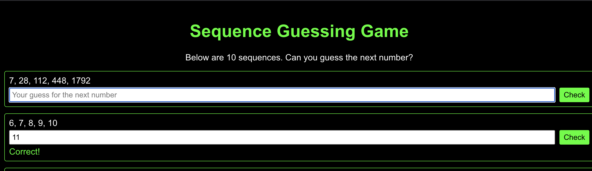

# Sequence Guessing Game

A mathematical sequence guessing game that challenges players to identify patterns and predict the next number in various sequences. The game can be run either as a React web application or Python streamlit.

## Installation

1. Clone the repository:

```bash
git clone https://github.com/helenadeus/guess.git
cd guess/sequence-guessing-py
```

2. (Python) Install dependencies:

```bash
pip install -r requirements.txt
```

3. (Python) Run the streamlit app:

```bash
streamlit run SequenceGuessingGame.py
```

4. (Python) Open your browser and navigate to `http://localhost:8501`


## Description

This game presents players with different types of mathematical sequences and asks them to predict the next number in each sequence. It includes various types of sequences:

- Arithmetic sequences (adding a constant)
- Geometric sequences (multiplying by a constant)
- Square number sequences
- Factorial sequences
- Multiply and add sequences (e.g., n * 3 + 2)
- Square and add sequences (e.g., n² + 3)

## Features

- 10 randomly generated sequences per game
- Immediate feedback on guesses
- Helpful hints when incorrect
- Clean, retro-style terminal interface
- Mobile-friendly design

## How to Play

1. Look at each sequence of numbers
2. Try to identify the pattern
3. Enter your guess for what the next number should be
4. Click "Check" to see if you're correct
5. If incorrect, a hint about the sequence type will be shown
6. Refresh the page to get new sequences


## Contributing

Pull requests are welcome. For major changes, please open an issue first to discuss what you would like to change.

## License

[MIT](https://choosealicense.com/licenses/mit/)

## Screenshots



## Author

Helena F. Deus

## Acknowledgments

- Inspired by mathematical sequence puzzles
- Built as a learning project for React
- Thank you team Cursor for the help! !(https://www.cursor.com/)